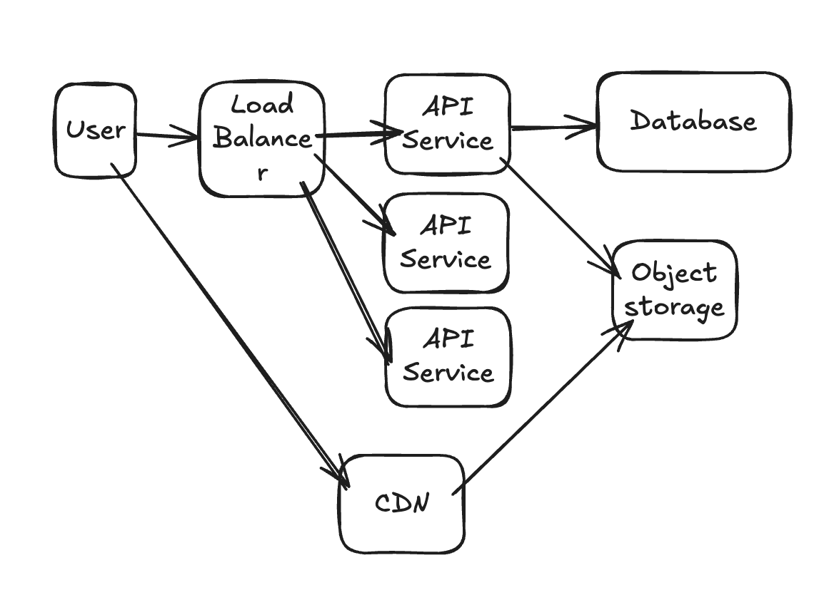

# Audio Retrieval Project

Hello there dear reviewer. My name is William, and let me tell you about the general idea of the solution of the project that I have made.

The main objective of the challenge is to have 2 APIs:
1. To upload audio file from a user, from a list of phrase.
2. To retrieve audio file that was uploaded before.

There are some additional requirements such as:
1. To provide a simple database with seeds of valid user ids and phrase ids.
2. To store file with user id and phrase id association.
3. Could convert audio file type when uploaded.
4. To get audio file based on request format.

Some exclusion:
1. No unit test. I already created a dependency injection pattern, which should make the code unit test easier to make. But to cut corner, I opt out of the unit test, and create sample of integration test instead.
2. No secure file storage.
3. Only some audio file type are supported. (you can upload mpeg, wav, or ogg and download converted ogg file). For easier testing, I have created the curl bash script in the integration test. Keep in mind that because it is a test, and it is suggested to keep things upload 1 type and download 1 type, I did so, but I do leave a comment on how to improve, I hope that's okay.
4. Logging level in the application could be separated to for example, error, warn, debug, etc. But for this test, I choose to exclude them.
5. Becasue I am not sure how the application would work on, for example if there is any re-upload, or should we keep the history, I choose to have a history of converted file stored in the DB + converted file in the directory + only origin file in the directory as well (without the directory in DB). I do have put a comment that we could clean them up if needed.
6. No other attribute of phrase or user in the database except id.

The design of the application is as follow:

It is a very simple design, not production quality ready. It could only have 1 API service which hold the responsibility of both API handling and storage system. The database app is separated using PostgreSQL.

For a better scalable design, I think I need more requirement and assumption to be cleared, but let start with a high level of this design:

With this design, we could scale the application better by having a load balancer to scale application to be horizontal scaling. We could also have object storage like S3 to be separated from the app service to have it scale better. Lastly we could also have CDN to serve the file retrieval faster for user. There are more detail which I haven't explore or perhaps needs question for you to brainstorm together.

There are of course improvements could be taken, and we haven't discuss about making the file secure, having proper monitoring, logs in place, convertion of audio file UX which could be asynchronous, caching mechanism, load testing, sharding, and much much more.

Now for this application prototype, here are the directory and explanation:

/root
    ./dev -> contains reflex for hot reload (e.g. save and it will rebuild docker)
    ./docker -> contains database scripts and seeds
    /cmd -> contains starting point of the application
    /files -> contains audio files
    /internal
        /entity -> model structure and methods
        /handler -> controller, which act as a facade to validate input and orchestrate sequential call
        /pkg -> helper functions
        /repo -> repository codes to handle data
        /usecase -> business logic file
    /vendor -> pls generate using go mod vendor
    /integration_test -> pls chmod +x the script here
    .gitignore
    docker-compose.yml
    go.mod
    go.sum
    image-1.png
    image.png
    Makefile
    README.md

HOW TO RUN:
1. Please check the docker-compose.yml and check if there are any conflict of docker environment.
    1.a. Please change the directory of the volume to your cloned directory, as the current code use relative path in the docker env for file path.
2. Run make download to download vendor and dependencies.
3. Run make services-up to run docker dependency and service
4. Run integration file for easier testing function

please do reach me in phan.william1296@gmail.com if there are any question / configuration that make it not work in your machine :).